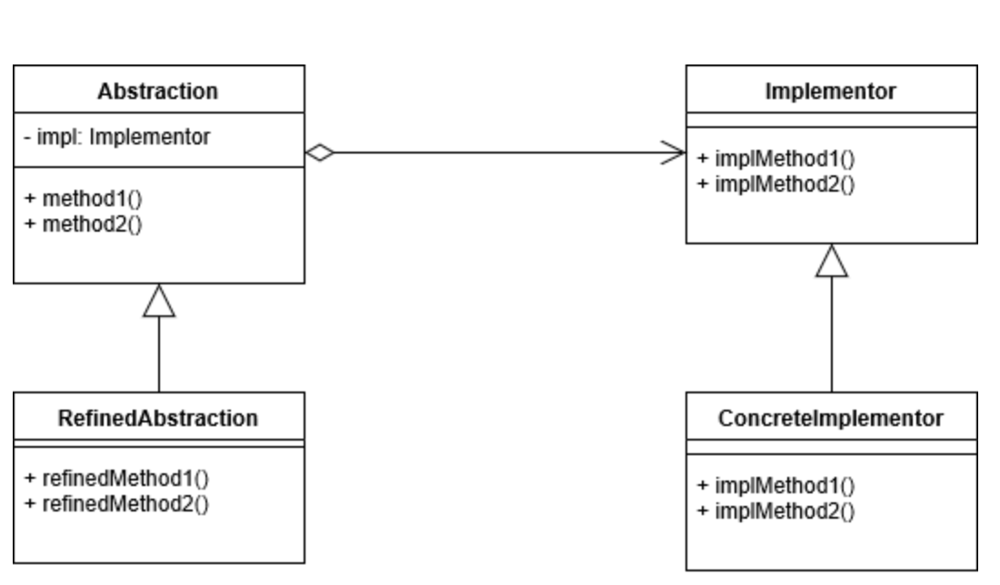
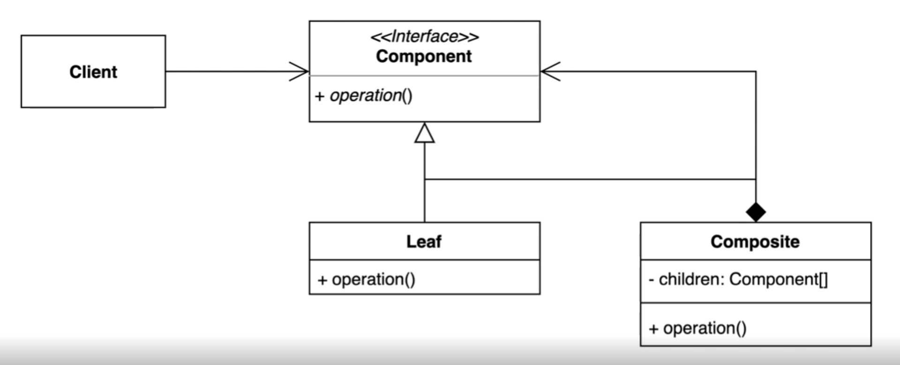
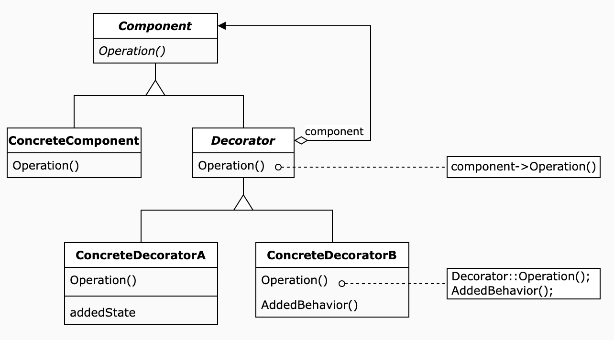
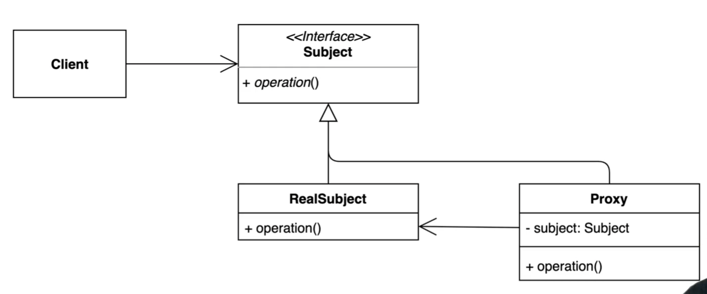
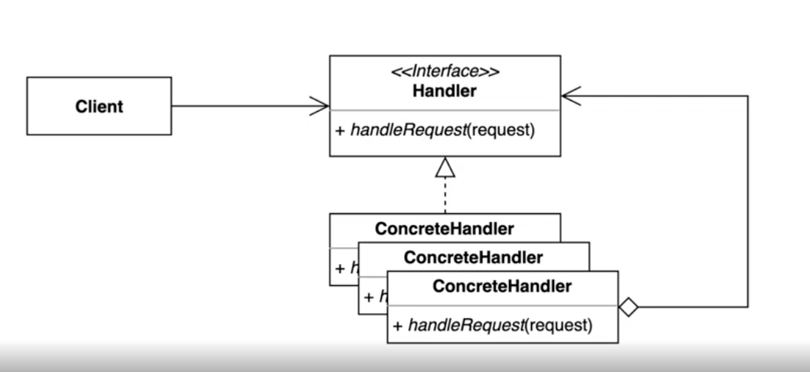
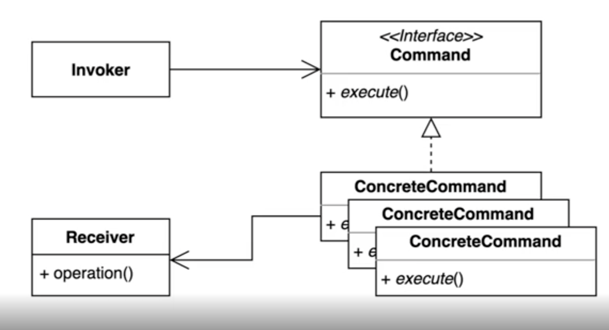

## [Inflearn] 코딩으로 학습하는 GoF의 디자인 패턴


1️⃣ [객체 생성 관련 디자인 패턴]


### 1. 싱글톤 패턴 - Singleton Pattern

인스턴스를 오직 한 개만 제공하여 글로벌하게 접근하는 클래스

- 사용 예 : 오직 하나의 정보만 존재해야 하는 것!

  - ex) 게임 세팅 값, 세션 값

- new 를 사용해서 생성하면 기존과 다른 새로운 객체가 생성되기 때문에 안됨

- 클래스 내에 private 생성자를 만들어 밖에서 인스턴스를 만들 수 없도록 한다.

- 내가 알던 싱글톤 사용 법

  ```swift
  class Settings {
      private static var instance: Settings?
  
      static var shared: Settings {
          if instance == nil {
              instance = Settings()
          }
          return instance!
      }
  }
  
  // 호출
  let setting1 = Settings.shared
  let setting2 = Settings.shared
  print(setting_1 === setting_2) // true
  ```

  또 아래처럼 사용하기도 한다.

  ```swift
  class Settings {
      private static var instance = Settings()
  
      static var shared: Settings {
          return instance
      }
      
      private init() {}
  }
  ```

  - `===` 은 동일한 참조값을 가지는지를 비교하는 방법

- 그런데 이렇게 되면 Setting 클래스 밖에서 아래와 같이 생성할 수 가 있다.

  ```swift
  let setting3 = Settings()
  ```

  - 이것을 방지하기 위해 클래스 내에 private 생성자를 선언해주면 밖에서 생성할 수 없게 된다.

    ```swift
    class Settings {
          private init() { } // 빈 private 생성자 선언
    }
    ```

    

- 그러나 위 방법은 멀티스레드 환경에서는 이 방법이 안전하지 않을 수 있다. (thread safe 하지 않음)

  - 이유 : 하나의 스레드가 `if instance == nil` 을 통과하고, 다음 줄의 인스턴스 생성 코드를 실행하기 전에 다른 스레드가 `if instance == nil` 을 통과한 경우, 다른 참조값을 가지는 객체 두 개가 생성될 수 있음!

  - 해결 방법

    1. [java 기준] 하나의 스레드만 들어올 수 있도록 하는 `synchronized` 키워드 사용하기

       - 단점 : 하나의 동기화를 위해 하나의 스레드가 들어오면 lock을 걸고, 작업을 마치면 lock을 해제하는 과정에서 성능이 저하될 수 있음

       - Objective-C 에는 `@synchronized` 키워드가 있지만, swift 에는 해당 키워드가 존재하지 않기 때문에 아래와 같이 직접 lock 해주는 방법을 이용할 수 있다.

         ```swift
         class Settings3 {
             
             static var instance: Settings3?
             
             static var getInstance: Settings3 {
                 sync(lock: self) {
                     if instance == nil {
                         instance = Settings3()
                     }
                 }
                 return instance!
             }
             
             private init() { }
         
             static func sync(lock: Any, closure: ()->Void) {
                 objc_sync_enter(lock)
                 closure()
                 objc_sync_exit(lock)
             }
         }
         ```

         

    2. 이른 초기화(eager initialization) 사용하기

       ```swift
       // 2. Eager Initialization
       class Settings2 {
           
           static var instance = Settings2()
           
           static var getInstacne: Settings2 {
               return instance
           }
           
           private init() { }
       }
       ```

       - 클래스가 생성되는 시점에 static 객체를 미리 만듦으로서 중복으로 생성되는 여지 자체를 없애는 방법
       - 단점 : 인스턴스를 만드는데 비용이 많이 드는 경우에 비효율이 초래될 수 있음

    3. [java 기준] Double Chekced Locking 사용하기

       ```java
       public static Settings getInstance() {
         if (instance == null) {
           synchronized (Settings.class) { // 
             if (instance == null) {
               instance = new Settings();
             }
           }
           return instance
         }
       }
       ```

       - 1번 방법이 객체 호출 시 마다 동기화에 걸리는 비용을 줄이기 위해 위와 같이 객체가 null인 경우에만 클래스를 lock 하여 사용할 수 있다.
       - 근데 synchronized 안에서는 null체크를 추가로 안해도될 것 같은데 왜 하는지 궁금하다
       - 장점 : 인스턴스가 필요할 때 생성할 수 있다.

    4. static inner 클래스 사용하기

       - 객체가 필요할때 생성하는 lazy 로딩도 가능하고, thread safty 한 방법

         ```swift
         // 5. Static Inner Class
         class Settings5 {
             
             private class SettingsHolder {
                 static var instance = Settings5()
             }
             
             static var getInstace: Settings5 {
                 return SettingsHolder.instance
             }
             
             private init() { }
         }
         ```

         

- 즉, 비용이 많이 들지 않은 경우에는 이른 초기화방법을 사용하는 것이 가장 깔끔한 방법인 것 같다. 객체 초기 생성에 비용이 많이 드는 경우에는 Static Inner Class 를 사용하면 좋을 것 같다.


### 2. 팩토리 메소드 패턴 - Factory Method Pattern

구체적으로 어떤 인스턴스를 만들지를 서브클래스에서 정하는 것


---

[2️⃣ 구조관련 디자인패턴]


### 1. 어댑터 패턴 - Adapter Pattern

1. 개념

   - 기본 코드를 클라이언트가 사용하는 인터페이스의 구현체로 바꿔주는 패턴

     - 상이한 인터페이스를 가지는 객체를 연결할 수 있도록 하는 어댑터 객체를 만드는 방법
       (각각 다른 인터페이스를 가지는 A, B 객체를 이어주는 C 어댑터 객체를 사용하는 방법)

     - 패키징 되어있는 라이브러리처럼 수정이 불가능한 경우에 별도의 어댑터 객체를 생성하여 수정할 수 있다.

2. 장점

   1. 기존 코드 (상이한 다른 인터페이스 객체)를 변경하지 않고 재사용할 수 있다.
      - 변화에는 닫혀있고, 확장에는 열려있다는 객체지향 원칙을 지킬 수 있음
   2. 기존 코드가 하던 일고, 새로운 인터페이스와 연결하는 클래스를 각각 분리하여 관리할 수 있다.
      - 단일 책임의 원칙을 지킬 수 있음


### 2. 브릿지 패턴 - Bridge Pattern

1. 개념

   - 추상적인 것(Abstract)과 구체적인 것(Concrete)을 분리하여 연결하는 패턴
   - 보통은 상속을 통해서 하나의 구조 안에서 추상적 개념을 상세화 하는데, 이렇게 되면 특징들이 늘어날수록 많은 종류의 상세클래스를 생성해야 한다.
   - 브릿지 패턴은 확장성에 용이하도록 하나의 구조가 아닌 독립적인 계층구조로 발전시키는 것

2. 예시

   - 스킨을 가지는 챔피언 객체

     - 스킨과 챔피언 종류가 여러개인 롤 캐릭터 챔피언을 생성한다고 할 때, 스킨이 생성될 때마다 해당 스킨에 해당하는 챔피언을 새로 생성해줘야 한다.

       ```swift
       - 좀비 카이사
       - 좀비 누누와윌럼프
       - 크리스마스 카이사
       - 크리스마스 누누와 윌럼프
       ```

     - 위와 같은 방법을 사용하면 스킨이 늘어나거나 챔피언 종류가 늘어날 때마다 추가해줘야하는 서브 클래스가 많아진다.

       (케인 캐릭터가 추가된다고 하면 크리스마스 케인, 좀비 케인을 추가해줘야 하며, 하와이 스킨이 추가된다고 하면 그에 해당하는 챔피언들을 추가해줘야 한다.)

     - 여기서 Skin 클래스를 Abstract 클래스로 분리하여 Champion 클래스에서 참조하도록 하여 구현이 가능하다.

   - Shpae 클래스

     - Shpae 하위클래스 Circle, Square 가 있을 때 Color 를 갖는 Shpae 클래스를 만드는 경우

       (BlueCircle, BlueSqare, PinkCircle, PinkSqare 등 많은 서브클래스를 생성해야 함)

     - Color 클래스와 Shpae 클래스를 각각 나누어 추상화를 하고, Shpae 객체가 Color 객체를 참조하게끔 함하여 브릿지 역할을 할 수 있다.

3. 역할

   

   - **Abstraction**(Champion) : 최상위 클래스. 추상 개념에 대한 인터페이스를 제공하고, 객체 구현자(implementor) 에 대한 참조자를 관리한다.
   - **RefinedAbstraction**(Skin) : 추상적 개념에 정의된 인터페이스를 *확장*하는 역할을 한다.
   - **Implementor**(DefaultChampion) : 구현 클래스에 대한 인터페이스를 제공한다. 실질적인 구현을 제공한 서브클래스들에게 공통 연산에 대한 메서드를 제공한다.
   - **ConcreteImplementor**(ZombieNoonoo) : Implementor 인터페이스를 구현해 실질적인 내용을 담은 클래스.

   Abstraction 과 Implementor 만 있었던 관계에서 RefiendAbstraction을 추가하여 확장에 용이하도록 한 것이고, 인터페이스의 공통된 영역만 구현한 것이 Implementor, 상세화한 것이 CompleteImplementor 로 보면 되는 듯 하다.

3. 장점

   - 추상적인 코드(abstract)를 구체적인 코드(concrete) 변경없이도 독립적으로 확장할 수 있다.

     즉, 하나의 클래스에서 추상클래스와 구체클래스를 구분하여, 확장에는 열려있고 변화에는 닫혀있도록 하는 객체지향 원칙을 지킬 수 있음

참고 : https://icksw.tistory.com/


### 3. 컴포짓(복합체) 패턴 - Composite Pattern

1. 개념

   - 트리구조에서 주로 쓰이며, 사용자 입장에서 구조에 상관없이 내부에 있는 객체에 접근할 수 있도록 하는 방법
   - 사용자(Client) 입장에서 전체나 부분을 구분하지 않고 모두 동일한 컴포넌트로 인식할 수 있는 계층구조를 만든다. (Part-Whole Hierachy)

2. 역할

   

   - **Component** (interface) : 집합 관계에 정의될 모든 객체에 대한 인터페이를 정의한다. 실제 구현할 객체에서 공통적으로 사용할 공통 요소, 행동을 정의한다. 필요하다면 인터페이스를 구현한다.
   - **Leaf** : 서브클래스가 없는 최하위 클래스. 객체의 요소 및 행동을 구현한다.
   - **Composite** : 서브클래스가 있는 클래스. 객체의 요소 및 행동을 구현한다.
   - **Client** : Component 인터페이스를 통해 복합 구조 내의 객체들에 접근한다.

3. 구현

   예시 : 아이템과 아이템을 보관하는 가방 객체가 있고, 아이템의 가격과 가방에 들어있는 모든 아이템의 가격을 가져오는 인터페이스를 만든다.

   - AS-IS 

     ```swift
     class CompositeApp {
         func start() {
             let bluePortion = Item(name: "파란물약", price: 60)
             let infinityGauntlet = Item(name: "인피니티 건틀릿", price: 200)
             
             let bag = Bag()
             bag.addItem(bluePortion)
             bag.addItem(infinityGauntlet)
             
             printPrice(item: bluePortion)
             printPrice(item: infinityGauntlet)
             printPrice(bag: bag)
         }
       
       	func printPrice(item: Item) {
             print(item.price)
         }
         
         func printPrice(bag: Bag) {
             print(bag.items.reduce(0, { return $0 + $1.price }))
         }
     }
     ```

     - 객체지향 측면에서 사용자가 가방의 모든 아이템을 조회해서 값을 얻어오는 것까지 접근할 필요가 없고, 종류에 상관없이 가격만 가져오면 되기 때문에 수정이 필요하다.

   - TO-BE

     ```swift
     // 1. Component
     protocol Component {
         func getPrice() -> Int
     }
     ```

     - 공통 인터페이스인 Component 를 추가해준다.

     ```swift
     // 2. Composite
     class Bag: Component {
         private var items: [Component] = []
     
         func getPrice() -> Int {
             return items.reduce(0, { return $0 + $1.getPrice() })
         }
     }
     ```

     - 하위 클래스인 Bag을 구성요소로 가지는 복합체인 Bag을 구현해준다.
     - 이때 아이템은 Item 이 아닌 Component 객체로 구현해준다. 서브클래스를 순회하여 가격을 가져오면 되므로 공통인터페이스인 getPrice를 이용해 가격을 가져오는 getPrice 함수를 구현한다.

     ```swift
     
     // 3. Leaf
     class Item: Component {
         var name: String
         private var price: Int
         
         init(name: String, price: Int) {
             self.name = name
             self.price = price
         }
         
         func getPrice() -> Int {
             return self.price
         }
     }
     ```

     - Leaf 에서는 위와 같이 공통 메서드인 getPrice()  를 구현해준다.

     ```swift
     // 4. Client
     class CompositeApp {
         func start() {
             let bluePortion = Item(name: "파란물약", price: 60)
             let infinityGauntlet = Item(name: "인피니티 건틀릿", price: 200)
             
             let bag = Bag()
             bag.addItem(bluePortion)
             bag.addItem(infinityGauntlet)
             
             printPrice(component: bluePortion)
             printPrice(component: infinityGauntlet)
             printPrice(component: bag)
         }
       
         // 추상인터페이스인 Component를 파라미터로 받는다.
         func printPrice(component: Component) {
             print(component.getPrice())
         }
     }
     ```

     - 사용자는 트리구조에 대한 추가적인 정보를 알 필요없이 공통 인터페이스인 getPrice() 를 이용해 값을 얻어온다.

4. 장단점

   - 장점
     - 복잡한 트리구조를 편하게 사용할 수 있다.
     - 다형성과 재귀를 활용할 수 있다.
     - 클라이언트 코드를 변경하지 않고 새로운 앨리먼트 타입을 추가할 수 있다.
       - 새로운 타입의 Leaf, Composite이 추가되더라도 클라이언트 코드(`getPrice()`)는 바뀌지 않는다.
       - getPrice를 가지는 새로운 객체가 추가되더라도 기존 코드를 수정할 필요 없이 확장이 가능하다 (Open/Closed Principle)
   - 단점
     - 공통 인터페이스를 정의하여 트리를 만들어야 하므로 지나치게 일반화해야 하는 경우도 생길 수 있다.
       - 추상화된 타입이 아닌 구체 타입에 접근해야 하는 경우에 타입을 체크하는 수고로움이 있는 경우에는 컴포짓패턴을 사용하는 것이 맞는지 한 번 더 고려해봐야 한다.

   

### 4. 데코레이터(장식자) 패턴  - Decorator Pattern

1. 개념
   - 객체에 동적으로 새로운 책임을 추가할 수 있게 하는 디자인 패턴
     - 객체에 추가 기능을 Runtime 에 동적으로 확장할 수 있는 디자인 패턴
   - 전체 클래스에 새로운 기능을 추가할 필요는 없지만, 개별적인 객체에 새로운 기능을 추가해야할 때 상속으로는 해결하기가 어렵다.
     - 서브클래스에 각각 다른 기능을 추가한다고 할 때, 다른  두 가지 기능을 동시에 가지는 객체를 만들기 위해서는 또 새로운 클래스를 정의해야 한다.(A기능 클래스, B 기능 클래스, A+B 기능 클래스)

2. 역할

   

   - **Component** (*CommentService*) : 동적으로 추가할 서비스를 가질 가능성이 있는 객체들에 대한 <u>인터페이스</u>
     - 예를 들어 댓글을 추가할 때, 필터링이나 예외처리 등 상황에 따라 다른 기능이 0개 이상으로 필요로 할 때 댓글 추가 기능이 있는 CommentService를 Component로 잡을 수 있다. 
   - **ConcreteComponent** (*DefaultCommentService*) : 추가적인 서비스가 실제로 정의되어야 할 필요가 있는 객체. Component의 기능을 직접 구현한다.
   - **Decorator** (CommentDecorator) : Component 객체에 대한 참조자를 관리하면서 Component에 정의된 인터페이스를 만족하도록 인터페이스를 정의하는 역할을 함.
     - 객체에 대한 참조자를 관리한다는 것은 내부에 Component 타입의 객체를 가지고 있다는 것을 의미한다.
   - **ConcreteDecorator** (*TrimmingCommentDecorator*, *SpamFilteringCommentDecorator*) : Component에 새롭게 추가할 서비스를 실제로 구현하는 클래스
     - 실제로 여기서 각각 다른 기능을 정의해준다.

3. 구현

   ```swift
   // 1. Component
   protocol CommentService {
       func addComment(_ comment: String)
       func printConmments()
   }
   ```

   - 다양화될 수 있는 (동적으로 서비스가 추가될 가능성이 있는) 객체에 대한 인터페이스를 정의한다.

   ```swift
   // 2. Concrete Component
   class DefaultCommentService: CommentService {
   
       var comments: [String] = []
   
       func addComment(_ comment: String) {
           self.comments.append(comment)
       }
       
       func printConmments() {
           for comment in comments {
               print(comment)
           }
       }
   }
   ```

   - Component의 인터페이스를 실제로 구현한다.
   - 여기에서는 별다른 추가 기능 없이 댓글이 있다면 추가해주는 기능만 구현되어있다.

   ```swift
   // 3. Decorator
   class CommentDecorator: CommentService {
       var commentService: CommentService
       
       init(service: CommentService) {
           self.commentService = service
       }
       
       func addComment(_ comment: String) {
           commentService.addComment(comment)
       }
       
       func printConmments() {
           commentService.printConmments()
       }
   }
   ```

   - Component 객체를 가지고 있으며, 이 객체와 기능(Concrete Component에 구현된)을 연결해준다.
   - 생성자로 Component 를 전달받는다.

   ```swift
   // 4. ConcreteDecorator
   class TrimCommentDecorator: CommentDecorator {
       
       override func addComment(_ comment: String) {
           let trimmedComment = comment.replacingOccurrences(of: "...", with: "")
           commentService.addComment(trimmedComment)
       }
   }
   ```

   ```swift
   // 4. ConcreteDecorator
   class SpamFilteringCommentDecorator: CommentDecorator {
       
       override func addComment(_ comment: String) {
           if !comment.contains("http") {
               commentService.addComment(comment)
           }
       }
   }
   ```

   - 동적으로 추가될 수 있는 기능들을 구현해준다.

   ```swift
   var enabledTrimming: Bool = true
   var enabledSapmFilter: Bool = true
   
   func start() {
   	var commentService: CommentService = DefaultCommentService()
           
   	if enabledTrimming {
   		commentService = TrimCommentDecorator(service: commentService)
   	}
           
   	if enabledSapmFilter {
       // 생성자 service 에는 TrimCommentDecorator 가 전달됨
       // 데코레이터가 데코레이터를 감싸는 형태
   		commentService = SpamFilteringCommentDecorator(service: commentService)
   	}
           
   	commentService.addComment("시선으로부터")
   	commentService.addComment("정세랑... 장편소설... ...")
   	commentService.addComment("(주)A에셋 동학농민개미 집중! 삼성 관련 700% 확정주 받기! https://open.kakao.com/o/gNqcCYKe")
   	commentService.printConmments()
     
     // [print]
     // 시선으로부터
   	// 정세랑 장편소설 
   }
   ```

   - Runtime에 동적으로 다른 서브클래스를 사용할 수 있는 패턴
   - 상속 없이도 두 가지의 속성(trimming, 스팸 필터링)을 모두 적용할 수 있음
     - 그 이유는 두 번째 `SpamFilteringCommentDecorator` 생성때 전달되는 service 파라미터가 `TrimCommentDecorator` 이기 때문에, filtering 과 trimming  두 가지 기능을 동시에 수행하는 객체가 만들어진다.
     - addComponent 메소드에 재귀적으로 접근하여 필터링 기능이 두 번 동작하게된다.
   - 동일한 인터페이스를 여러 군데에서 상속받는 복잡한 구조로 보이지만, 상황에 따라 유연하게 사용할 수 있다는 특징을 가지고 있는 듯 하다.

4. 장단점

   - 장점
     - 새로운 클래스를 만들지 않고 기존 기능을 <u>조합하여</u> 사용할 수 있다.
       - 객체지향 단일 책임의 원칙(본연의 기능만 수행하도록 할 수 있다.)
     - 런타임에 동적으로 기능을 변경할 수 있다.
   - 단점
     - 코드가 복잡해질 수 있다.

5. 예제 만들어보기

   - 넣는 재료에 따라 가격이 달라지는 아메리카노 객체 만들기! 
   
     ```swift
     func customExcerciseStart() {
             var hasHazelnutSyrup: Bool = true
             var hasVanillaSyrup: Bool = true
             
             var americano: Americano = DefaultAmericano()
             if hasHazelnutSyrup {
                 americano = HazelnutAmericanoDecorator(americano: americano)
             }
             if hasVanillaSyrup {
                 americano = VanillaAmericanoDecorator(americano: americano)
             }
             print(americano.cost())
     }
     ```
   
     

### 5. 퍼사드 패턴 - Pacade Pattern

1. 개념

   - 클라이언트가 알 필요가 없는 세부 내용을 퍼사드(인터페이스) 뒤로 숨겨 복잡한 서브 시스템 의존성을 최소화하는 방법
     - 클라이언트가 사용해야 하는 복잡한 서브 시스템 의존성을 간단한 인터페이스로 추상화하는 방법
     - 기능에 대한 인터페이스만 제공하고, 클라이언트가 알 필요가 없는 복잡한 시스템은 사용자가 알 필요 없도록 숨기는 방법 (의존성을 줄이는 방법)

2. 장단점

   - 서브시스템에 대한 의존성을 한 곳으로 모을 수 있다.

     (여러 곳에 있는 의존성을 통일하여 한 곳에서 관리할 수 있다.)

   

### 6. 플라이웨이트 패턴 - Flyweight Pattern

1. 개념

   - 객체를 가볍게 만들어 메모리 사용을 줄이는 패턴
   - 많은 인스턴스가 생성되는 경우에 메모리를 효율적으로 사용하기 위해 인스턴스를 재사용하는 방법
     - 자주 변하는 속성과 변하지 않는 속성을 분리하고 재사용하여 메모리 사용을 줄일 수 있다
     - 객체를 일일이 생성하지 않고, 이미 생성된 객체의 값만 리턴하도록 하는 방법

2. 특징

   - 공통적으로 사용하는 속성(변하지 않는 속성)은 immutable 하게 구현하여 다른 곳에서 변경할 수 없도록 한다.

3. 구현방법`

   ```swift
   class FlyWeightApp {
   
   	func ASIS_start() {
           let c1 = Character(value: "h", color: .black, font: UIFont(name: "나눔", size: 12)!)
           let c2 = Character(value: "e", color: .red, font: UIFont(name: "나눔", size: 12)!)
           let c3 = Character(value: "l", color: .blue, font: UIFont(name: "나눔", size: 12)!)
           let c4 = Character(value: "l", color: .yellow, font: UIFont(name: "나눔", size: 12)!)
           let c5 = Character(value: "5", color: .green, font: UIFont(name: "나눔", size: 12)!)
   	}
   }
   ```

   - 위와 같이 구현하게 되면 동일한 값을 가지는 UIFont 객체를 중복으로 생성하게 된다.
   - 위 코드에서는 별 문제가 되지 않지만, 객체가 굉장히 많이 생성된다고 하는 경우에는 메모리이슈가 생길 수 있다.

   ```swift
   class FontFactory {
       private var cache: [String: UIFont] = [:]
       
       func getFont(name: String, size: CGFloat) -> UIFont {
           if cache[name] == nil {
               cache[name] = UIFont(name: name, size: size)
           }
           return cache[name]!
       }
   }
   
   class FlyWeightApp {
   
    func start() {
           let fontFactory = FontFactory()
           let c1 = Character(value: "h", color: .black, font: fontFactory.getFont(name: "나눔", size: 12))
           let c2 = Character(value: "e", color: .red, font: fontFactory.getFont(name: "나눔", size: 12))
           let c3 = Character(value: "l", color: .blue, font: fontFactory.getFont(name: "나눔", size: 12))
           let c4 = Character(value: "l", color: .yellow, font: fontFactory.getFont(name: "나눔", size: 12))
           let c5 = Character(value: "5", color: .green, font: fontFactory.getFont(name: "나눔", size: 12))
       }
   }
   ```

   - 이처럼 factory 클래스의 캐싱를 사용해서 동일한 값을 가지는 변하지않는 속성은 객체를 추가로 생성하지 않고 재사용이 가능하다.
   - 기존 구조를 개선하는 패턴과는 다르게 성능을 개선하는 목적이 더 크다.

4. 장단점
   - 장점 : 메모리 성능 개선
   - 단점 : 코드 복잡도 증가


### 7. 프록시 패턴 - Proxy Pattern

1. 개념

   - 특정 객체에 대한 접근을 제어하거나 기능을 추가할 수 있는 패턴 (proxy 객체(대리인)를 거쳐서 특정 행동이 가능하도록 하는 방법)
     - 초기화 지연, 접근 제어, 로깅, 캐싱 등 다양하게 응용해서 사용할 수 있다.

2. 구조 및 특징

   

   - Client 는 RealSubject에 곧바로 접근하지 않고 Proxy 객체에 접근하게 된다.
   - Proxy 객체는 본인과 RealSubject의 타입인 객체를 참조하고 있다. 이는 RealSubject에 접근하기 위함이다.
   - Java 에서는 Proxy 객체를 만드는 공통화된 작업을 하지 않아도 runtime 에서 쉽게 사용할 수 있도록 dynamic proxy 기능을 제공한다. Swift도 이와 비슷한 Mirror객체가 있는 듯 하다..!

3. 구현

   ```swift
   // 1. Inerface
   protocol GameService {
       func startGame();
   }
   ```

   ```swift
   // 2. Real Subject
   class RealGameService: GameService {
       func startGame() {
           print("게임을 시작합니다.")
       }
   }
   ```

   ```swift
   // 3. Proxy Subject
   class ProxyGameService: GameService {
       var gameService: GameService?   // 인터페이스 타입에 대한 참조를 가진다.
       
       func startGame() {
           // 프록시패턴 - 이른 초기화(Eager Initialization) 사용
           if gameService == nil {
               gameService = RealGameService()
           }
           gameService!.startGame()
       }
   }
   ```

   ```swift
   func start() {
           let gameService = ProxyGameService()
           gameService.startGame()
   }
   ```

   

4. 장점

   - 기존 코드를 수정하지 않고 구현이 가능하다. (실제로 객체를 사용하는 코드는 그대로 두고, Proxy 와 Real 클래스로 나누어서 추가적인 처리가 가능함!)
     - 객체지향 Open Closed Principle 원칙
   - 초기화 지연, 캐싱, 로깅, 시간측정 등을 구현할 수 있음
   
   - 상속이 아닌 인터페이스(프로토콜)을 이용하기 때문에 제약사항 (한 개의 상속만 가능, final 키워드 사용시 상속 불가능 등)에서 조금 더 자유롭다.


---

[3️⃣ 행동 관련 디자인 패턴]


### 1. 책임 연쇄 패턴 - Chain-of-Respnosibiltiy Pattern

1. 개념

   - 요청을 보내는 쪽(sender)과 요청을 처리하는 쪽(receiver)을 분리하는 패턴
   - 요청을 처리하는 쪽에서 단일 책임의 원칙을 지킬 수 있도록 연쇄된 구조로 책임을 처리하도록 하는 방법

2. 구조 및 특징

   

3. 구현

4. 장단점


### 2. 커맨드 패턴

1. 개념

   - 요청을 보내는 invoker와 요청을 받아 처리하는 receiver 사이가 긴밀하게 연결되어있을 때 이를 분리하는 패턴. (결합도가 높으면 하나를 수정할 때 영향을 받는 코드가 많아짐)
   - <u>요청을 처리하는 방법이 바뀌더라도 호출자(invoker)의 코드는 바뀌지 않도록 하는 방법</u>

2. 구조 및 특징

   

   - Invoker : 요청을 보내는 부분
   - Receiver : 요청을 받아 처리하는 부분

3. 구현

   - AS-IS

     - Receiver 인 Light, ScreenSetting 이 변경될 때 마다 Invoker의 코드를 일일이 수정해주어야 함

   - TO-BE

     - Invoker 와 Receiver를 구분한다.

       ```swift
       // 1. Invoker
       class CustomButton {
           func buttonDidTap() {
       			// 버튼이 눌렸을때 동작을 처리한다.
           }
       }
       ```

       ```swift
       // 2. Receiver
       class Light {
           private var isOn: Bool = false
           
           func switchLightOnOff() {
               if self.isOn {
                   lightOff()
               } else {
                   lightOn()
               }
           }
           
           private func lightOn() {
               isOn = true
               print("불이 켜졌습니다.")
           }
           
           private func lightOff() {
               isOn = false
               print("불이 꺼졌습니다.")
           }
       }
       
       // 2. Receiver
       class ScreenSetting {
           
           enum ScreenMode {
               case darkMode
               case whiteMode
           }
           
           private var screenMode: ScreenMode = .whiteMode
           
           func switchScreenMode() {
               if self.screenMode == .whiteMode {
                   setDarkMode()
               } else {
                   setWhiteMode()
               }
           }
           
           private func setDarkMode() {
               screenMode = .darkMode
               print("다크모드로 전환되었습니다.")
           }
           
           private func setWhiteMode() {
               screenMode = .whiteMode
               print("일반모드로 전환되었습니다.")
           }
       }
       ```

     - 동작을 수행하는 Command 인터페이스를 정의한다.

       ```swift
       // 3. Command Interface
       protocol Command {
           func execute()
       }
       ```

     - Receiver 에 따라 다른 기능을 구현하도록 연결하는 Concrete Command 클래스를  구현한다.

       ```swift
       // 4. Concrete Command
       class LightOnOffCommand: Command {
           
           var light: Light
           
           init(light: Light) {
               self.light = light
           }
           
           func execute() {
               light.switchLightOnOff()
           }
       }
       
       class ScreenSettingCommand: Command {
           private var screenSetting: ScreenSetting
           
           init(screenSetting: ScreenSetting) {
               self.screenSetting = screenSetting
           }
           
           func execute() {
               screenSetting.switchScreenMode()
           }
       }
       ```

     - Client 는 아래와 같이 호출하면 된다.

       ```swift
       class CommandApp {
           
           func start() {
               let lightButton = CustomButton(command: LightOnOffCommand(light: Light()))
               lightButton.buttonDidTap()
               lightButton.buttonDidTap()
               lightButton.buttonDidTap()
               lightButton.buttonDidTap()
               
               let screenSettingButton = CustomButton(command: ScreenSettingCommand(screenSetting: ScreenSetting()))
               screenSettingButton.buttonDidTap()
               screenSettingButton.buttonDidTap()
               screenSettingButton.buttonDidTap()
           }
       }
       ```

       - Invoker (CustomButton) 은 변경하지 않고 구현이 가능하다.

4. 장점

   - Invoker를 수정하지 않고 Receiver를 추가할 수 있다는 점에서 Open Closed 원칙을 지향함
   - 각 Command 는 각자의 기능만을 하고 있기 때문에 단일 책임의 원칙을 지향함

   - 각 Command 객체들은 재사용이 가능함
