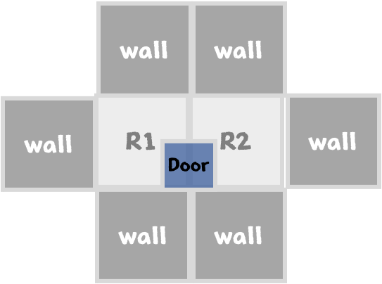

# Design-Pattern


### GoF 디자인 패턴

- 생성 패턴

  - 추상 팩토리
  - 팩토리 메서드
  - 싱글턴

- 구조 패턴

  - 컴퍼지트
  - 데커레이터

- 행위 패턴

  - 옵저버
  - 스테이트
  - 스트래티지
  - 템플릿 메서드
  - 커맨드

  

---

#### 예제 프로젝트 - 미로 맵 생성 


> 기본 미로 맵 생성 클래스

1. MapSite : 맵 각 요소에 대한 정보를 가지고 있는 프로토콜 
2. Room : 맵 요소 중 방 클래스, MapSite 를 채택한다. 연결된 네 공간에 대한 정보를 가지고 있다.
3. Wall : 맵 요소 중 벽 클래스, MapSite 를 채택한다. 이동할 수 없는 공간이다.
4. Door: 맵 요소 중 문 클래스, MapSite 를 채택한다. 연결된 두 방에 대한 정보를 가지고 있다.

5. Maze : 방에 대한 정보를 가지고 있는 클래스
6. MazeGame : 사용자가 접근하는 클래스. 





> 기본 미로 맵의 createGame 메소드

```swift
public class MazeGame {
  
  // 방 두 개 짜리 맵을 생성
  private func createGame() -> Maze {
    let maze = Maze()
    let room1 = Room(roomNumber: 1)
    let room2 = Room(roomNumber: 2)
    let door = Door(room1: room1, room2: room2)
    
    maze.addRoom(room: room1)
    maze.addRoom(room: room2)
    
    room1.setSide(direction: .east, site: door)
    room2.setSide(direction: .west, site: door)
    
    return maze
  }
}
```

- 문제점 : 방, 문, 벽에 대해 각각의 생성자를 이용해 만들어 주도록 하드코딩 되어있음 (객체 생성을 유연하게 하지 못함)

  
